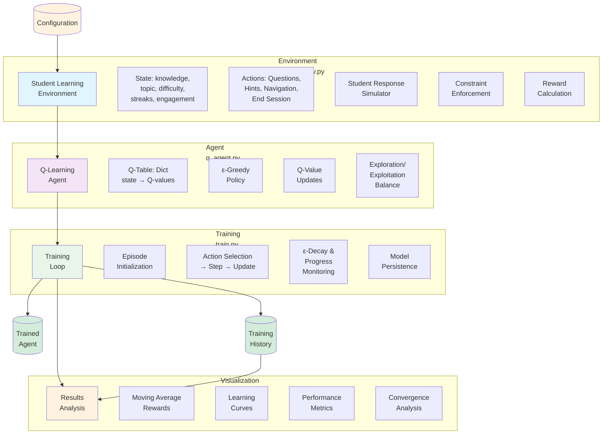

# Personalized Learning and Intelligent Assessment System

## Introduction

This project implements a **Reinforcement Learning (RL) based intelligent tutoring system** that learns optimal teaching strategies to maximize student learning outcomes and engagement. Using **Q-Learning** with ε-greedy exploration, the agent learns to adaptively select questions, provide hints, and manage topic progression based on student performance and engagement levels.

The system simulates a realistic student learning environment where an AI tutor must balance:
- **Question difficulty** (Easy/Medium/Hard)
- **Timing of hints** and interventions
- **Topic progression** decisions
- **Session management**

---

## System Architecture



---

## Setup

### Prerequisites
- Python 3.8+
- NumPy
- Matplotlib

### Installation

1. **Clone/Download** the project files:
   ```bash
   cd /path/to/project
   ```

2. **Install dependencies** (if needed):
   ```bash
   pip install numpy matplotlib
   ```

3. **Verify file structure**:
   ```
   NRL/
   ├── config.py          # Configuration constants
   ├── student_env.py     # Learning environment
   ├── q_agent.py         # Q-Learning agent
   ├── train.py           # Training script
   ├── plot_results.py    # Visualization
   └── README.md          # This file
   ```

---

## How to Run

### 1. Train the Agent
Run the full training loop (1000 episodes):
```bash
python train.py
```

This will:
- Train for 1000 episodes with progress updates every 100 episodes
- Save the trained agent as `trained_agent.pkl`
- Save training history as `training_rewards.pkl`

### 2. Visualize Results
Analyze training performance and convergence:
```bash
python plot_results.py
```

This generates:
- `training_rewards.png` - Reward progression with moving averages
- `reward_distribution.png` - Reward distribution histogram
- `learning_curves.png` - Combined rewards and episode lengths

### 3. Quick Testing
For development/testing with fewer episodes:
```python
# Modify config.py temporarily
NUM_EPISODES = 50  # Instead of 1000
EVAL_INTERVAL = 5   # Instead of 100
```

---

## Core RL Logic: Deep Technical Analysis

### 1. Markov Decision Process (MDP) Formulation

#### **State Space S** (6-dimensional tuple)
```
s = (knowledge_level, current_topic, question_difficulty,
     consecutive_correct, consecutive_wrong, engagement_score)

Where:
- knowledge_level ∈ {0, 1, 2} = {Beginner, Intermediate, Advanced}
- current_topic ∈ {0, 1, 2} = {Topic 1, Topic 2, Topic 3}
- question_difficulty ∈ {0, 1, 2} = {Easy, Medium, Hard}
- consecutive_correct ∈ {0, 1, 2, 3, 4, 5} (max 5)
- consecutive_wrong ∈ {0, 1, 2, 3} (max 3)
- engagement_score ∈ {0, 1, 2} = {Low, Medium, High}
```

**Total State Space Size**: `3 × 3 × 3 × 6 × 4 × 3 = 1,944` states

#### **Action Space A** (7 discrete actions)
```
a ∈ {0, 1, 2, 3, 4, 5, 6}

Actions:
0: Present_Easy_Question
1: Present_Medium_Question
2: Present_Hard_Question
3: Give_Hint
4: Review_Previous_Topic
5: Move_To_Next_Topic
6: End_Session
```

#### **Reward Function R(s, a, s')**

The reward function is designed to encourage optimal teaching behavior:

**Correct Answer Rewards:**
- Hard Question Correct: **+10**
- Medium Question Correct: **+5**
- Easy Question Correct: **+3**

**Wrong Answer Penalties:**
- Any Wrong Answer: **-5**

**Knowledge Progression Rewards:**
- Topic Completion: **+15**
- Knowledge Level Up (Beginner→Intermediate): **+20**

**Engagement Dynamics:**
- Engagement Increase: **+8**
- Engagement Drop to Low: **-10**

**Teaching Action Penalties:**
- Give Hint: **-3** (discourages over-reliance)
- Question too Easy: **-8** (wastes time)
- Question too Hard: **-12** (frustrates student)

**Session Management:**
- Successful Session (High engagement + completion): **+50**
- Early Quit/Frustration: **-30**

**Constraint Violations:**
- Invalid actions (e.g., hard questions for beginners): **-20**

#### **State Transition Dynamics P(s'|s,a)**

**Student Response Simulation:**

For question actions (a ∈ {0,1,2}), student correctness probability depends on difficulty vs knowledge:

```
difficulty < knowledge_level  → P(correct) = 0.8  (Easy for Advanced)
difficulty = knowledge_level  → P(correct) = 0.6  (Appropriate difficulty)
difficulty > knowledge_level  → P(correct) = 0.3  (Hard for Beginner)
```

**Engagement Transitions:**

```
P(engagement↑ | correct_answer) = 0.3
P(engagement↓ | wrong_answer) = 0.4
```

**Knowledge Advancement:**

3 consecutive correct answers → knowledge_level = min(2, knowledge_level + 1)

**Streak Management:**
- Correct answer → consecutive_correct += 1, consecutive_wrong = 0
- Wrong answer → consecutive_correct = 0, consecutive_wrong += 1
- 3 consecutive wrong → episode terminates (dropout)

### 2. Q-Learning Algorithm

#### **Core Algorithm: Temporal Difference Learning**

Q-Learning learns the optimal action-value function Q*(s,a) through experience:

**Q-Value Update Rule:**
```
Q(s,a) ← Q(s,a) + α[r + γ·max_a' Q(s',a') - Q(s',a')]
```

Where:
- **α (alpha)**: Learning rate = 0.1
- **γ (gamma)**: Discount factor = 0.9
- **r**: Immediate reward from taking action a in state s
- **s'**: Resulting state after action a

#### **Q-Table Implementation**

Due to sparse state space, we use a Python dictionary:
```python
q_table: Dict[Tuple[int,int,int,int,int,int], List[float]]
# Key: state tuple, Value: [Q(s,a₀), Q(s,a₁), ..., Q(s,a₆)]
```

**Initialization**: Q(s,a) = 0.0 for all unseen state-action pairs

#### **Policy: ε-Greedy Exploration**

**Action Selection Strategy:**
```
With probability ε: Choose random action a ∈ A      (Exploration)
With probability 1-ε: Choose a = argmax_a Q(s,a)     (Exploitation)
```

**ε-Decay Schedule:**
```
ε₀ = 1.0                    # Initial exploration
εₜ = ε₀ × (0.995)ᵗ          # Exponential decay per episode
ε_min = 0.01                # Minimum exploration rate
```

#### **Q-Learning Convergence Properties**

**Theoretical Guarantees:**
- Q-Learning converges to optimal Q* with probability 1 if:
  - All state-action pairs visited infinitely often
  - α decreases appropriately (Robbins-Monro conditions)
  - ε decreases to 0

**Practical Convergence:**
- Moving average of rewards stabilizes
- Q-table non-zero entries increase initially then stabilize
- Agent learns constraint satisfaction (negative rewards avoided)

### 3. Training Dynamics

#### **Episode Structure**
Each episode simulates one learning session:
1. Reset environment to initial state s₀
2. For t = 0 to MAX_STEPS (30):
   - Select action aₜ using ε-greedy policy
   - Execute aₜ, observe rₜ, sₜ₊₁
   - Update Q(sₜ, aₜ) using TD rule
   - s ← sₜ₊₁
3. Episode ends when done=True (session ended or dropout)

#### **Learning Progression**
- **Early Training**: High ε → exploration, frequent constraint violations
- **Mid Training**: Q-values stabilize, agent learns valid actions
- **Late Training**: Low ε → exploitation, optimal policy emerges

#### **Performance Metrics**
- **Total Episode Reward**: Σ rₜ over episode
- **Episode Length**: Number of steps until termination
- **Convergence Indicator**: Moving average reward stabilization
- **Policy Quality**: Success rate in evaluation

### 4. Implementation Details

#### **Sparse State Handling**
- Only visited states stored in Q-table
- Memory efficient: O(|visited states| × |actions|)
- Fast lookups for common states

#### **Reward Shaping**
- Dense rewards for incremental progress
- Heavy penalties for constraint violations
- Sparse terminal rewards for session outcomes

#### **Exploration Strategy**
- High initial ε ensures state space coverage
- Exponential decay balances exploration/exploitation
- Minimum ε prevents complete exploitation lock-in

### 5. Mathematical Foundations

#### **Bellman Optimality Equation**
The optimal Q-function satisfies:
```
Q*(s,a) = E[r + γ·max_a' Q*(s',a') | s,a]
```

Q-Learning approximates this through sampling.

#### **Value Iteration vs. Q-Learning**
- **Value Iteration**: Requires complete model P(s'|s,a), R(s,a)
- **Q-Learning**: Model-free, learns from experience tuples (s,a,r,s')

#### **Temporal Difference Learning**
TD methods learn from incomplete episodes:
```
V(s) ← V(s) + α[TD_target - V(s)]
TD_target = r + γ·V(s')     # TD(0)
TD_target = r + γ·Q(s',a')  # SARSA
TD_target = r + γ·max_a Q(s',a)  # Q-Learning
```

---

## Files Overview

### `config.py`
- Hyperparameters (α, γ, ε parameters)
- State/action space definitions
- Reward values and probabilities
- Constants for environment dynamics

### `student_env.py`
- `StudentLearningEnv` class implementing Gym-like interface
- State management and transitions
- Student response simulation
- Constraint enforcement and reward calculation

### `q_agent.py`
- `QLearningAgent` class with Q-table management
- ε-greedy action selection
- Q-value updates and policy extraction
- Model persistence (save/load Q-table)

### `train.py`
- Training loop for 1000 episodes
- Progress monitoring and evaluation
- Agent assessment and data collection

### `plot_results.py`
- Training visualization with moving averages
- Performance analysis and convergence plots
- Statistical summaries

---

## Expected Results

### Training Convergence
- **Early episodes**: Negative rewards (-50 to -200), random exploration
- **Mid training**: Improving rewards (-20 to +20), learning constraints
- **Late training**: Stable positive rewards (+30 to +80), optimal policy
- **Moving average**: Smooth convergence over 50-100 episodes

### Learned Behaviors
- Avoids constraint violations (no -20 penalties)
- Presents appropriate difficulty questions
- Times hints effectively
- Manages topic progression optimally
- Ends sessions at optimal times

### Performance Metrics
- **Success Rate**: >80% in evaluation (high engagement + completion)
- **Average Reward**: +40 to +60 per episode
- **Q-Table Size**: 300-600 visited states
- **Convergence Time**: ~200-400 episodes

---

## Technical Notes

### Computational Complexity
- **Space**: O(|visited states| × |actions|) ≈ O(500 × 7) = 3.5KB
- **Time**: O(1) per Q-update, fast dictionary operations
- **Training**: ~30 seconds for 1000 episodes on modern hardware

### Extensions
- **Deep Q-Learning**: Replace tabular with neural network approximation
- **Multi-Agent**: Multiple students with different learning profiles
- **Curriculum Learning**: Adaptive difficulty scaling
- **Transfer Learning**: Knowledge transfer between topics

### Validation
- **Internal Consistency**: Reward function aligns with educational goals
- **Realistic Dynamics**: Student response probabilities based on cognitive models
- **Convergence Proof**: Q-Learning theoretical guarantees
- **Empirical Results**: Moving average convergence demonstrates learning
